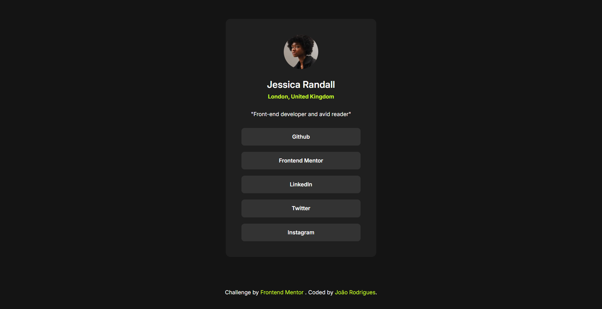

# Frontend Mentor - Social links profile solution

This is a solution to the [Social links profile challenge on Frontend Mentor](https://www.frontendmentor.io/challenges/social-links-profile-UG32l9m6dQ). Frontend Mentor challenges help you improve your coding skills by building realistic projects.

## Table of contents

- [Overview](#overview)
  - [The challenge](#the-challenge)
  - [Screenshot](#screenshot)
  - [Links](#links)
- [My process](#my-process)
  - [Built with](#built-with)
  - [What I learned](#what-i-learned)
- [Author](#author)

## Overview

### The challenge

Users should be able to:

- See hover and focus states for all interactive elements on the page

### Screenshot

### Links

- Solution URL: [solution URL](https://your-solution-url.com)
- Live Site URL: [Live site URL](https://joao0330.github.io/social-links-profile-frontendmentor)

## My process

### Built with

- Semantic HTML5 markup
- TailwindCSS (Play CDN)
- Flexbox
- Mobile-first workflow

### What I learned

For the first time on this project I used the tailwindCSS outside of a react app using the Play CDN. Since it was my first time using this on a vanilla project I didn't know if there was a way to add my own utility classes and style specific elements so in the end, there is a lot of repetitive css but my goal here was to try something I haven't done before and it was an interesting experience.

## Author

- Website - [João Rodrigues](https://joaogrodrigues.dev)
- Frontend Mentor - [@Joao0330](https://www.frontendmentor.io/profile/Joao0330)
